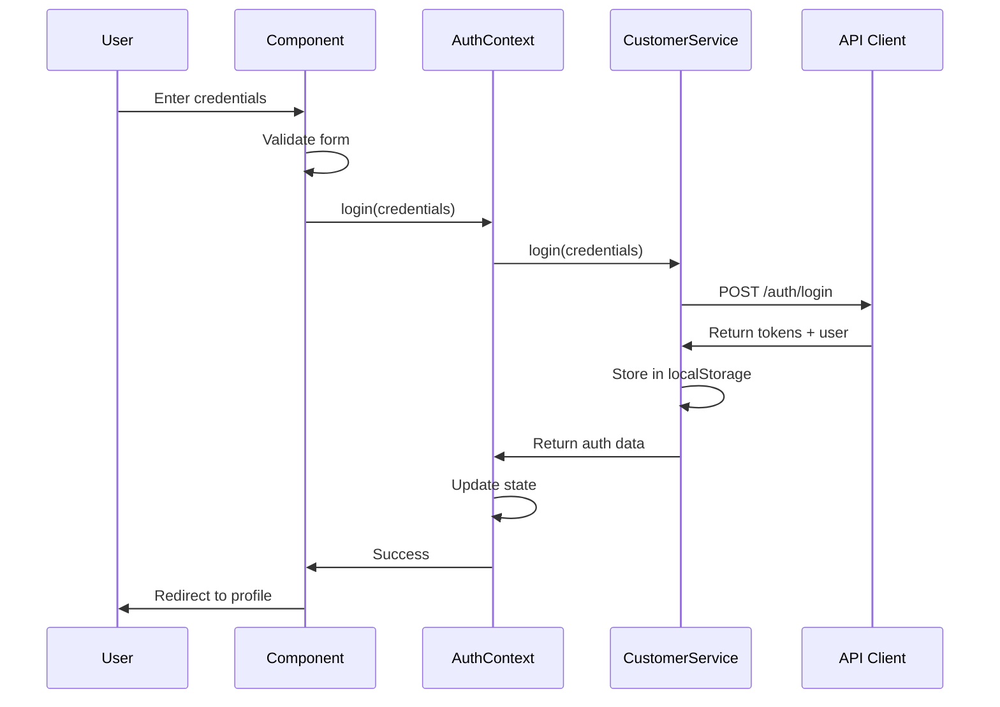
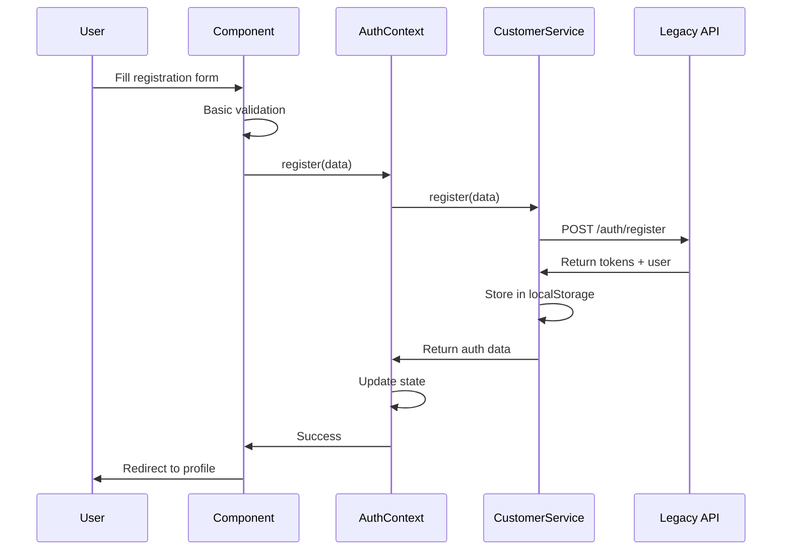
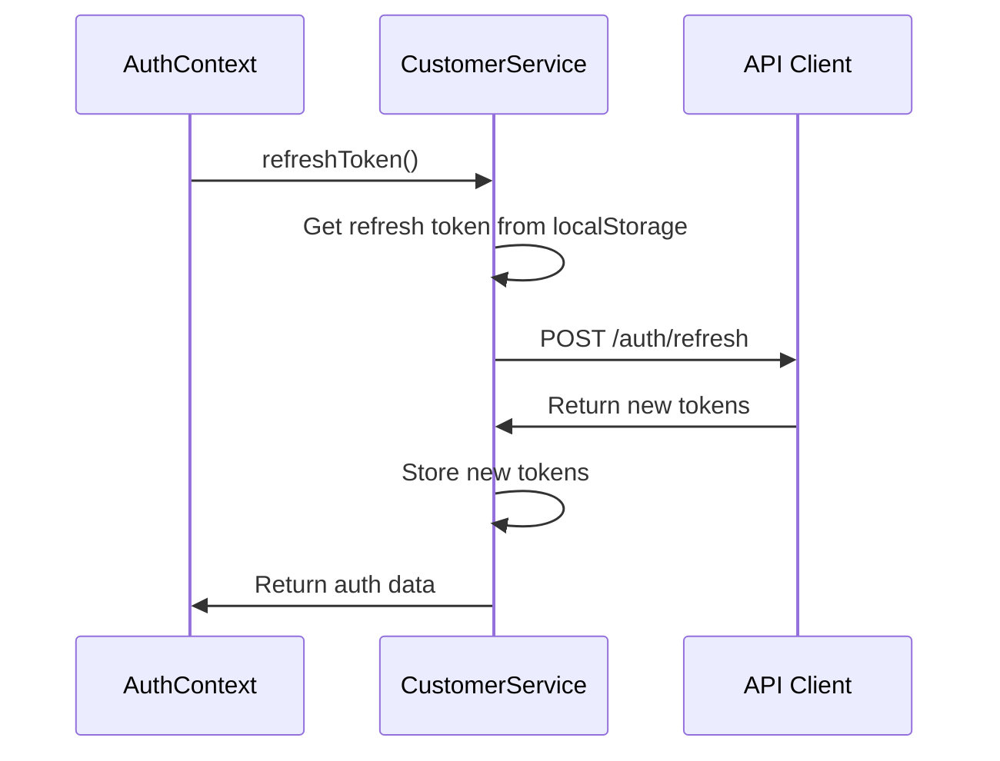

# Current Authentication Flow Analysis

## 🔍 Overview

This document provides a comprehensive analysis of the existing authentication system in the SmartSeller storefront, identifying current implementation patterns, security strengths, vulnerabilities, and areas for improvement.

## 📊 Current Architecture

### Authentication Stack
```
┌─────────────────┐    ┌─────────────────┐    ┌─────────────────┐
│   React Pages   │    │   Auth Context  │    │  Customer       │
│   (Login/Reg)   │◄──►│   (State Mgmt)  │◄──►│  Service        │
└─────────────────┘    └─────────────────┘    └─────────────────┘
         │                       │                       │
         ▼                       ▼                       ▼
┌─────────────────┐    ┌─────────────────┐    ┌─────────────────┐
│   Auth          │    │   useAuth Hook  │    │   API Clients   │
│   Components    │    │   (Utilities)   │    │   (Generated)   │
└─────────────────┘    └─────────────────┘    └─────────────────┘
```

## 🏗️ Current Implementation Analysis

### ✅ **Strengths**

#### 1. **Well-Structured Architecture**
- **Separation of Concerns**: Clear separation between UI components, state management, and API services
- **Context-Based State**: Uses React Context for global authentication state
- **Custom Hooks**: Provides convenient `useAuth` hook with utilities
- **Type Safety**: Full TypeScript implementation with proper interfaces

#### 2. **Modern React Patterns**
- **Functional Components**: Uses modern React functional components with hooks
- **Context API**: Proper use of React Context for state management
- **Error Boundaries**: Proper error handling in auth context
- **Loading States**: Implements loading states for better UX

#### 3. **Generated API Integration**
- **OpenAPI Client**: Uses generated API client for type safety
- **Dual Client Support**: Maintains both legacy and generated API clients
- **Type Conversion**: Proper conversion between API types and internal types

#### 4. **User Experience Features**
- **Form Validation**: Client-side validation with real-time feedback
- **Password Strength**: Basic password strength validation
- **Social Login Placeholder**: Infrastructure for social authentication
- **Tenant Awareness**: Multi-tenant support with tenant-specific features

### ⚠️ **Security Vulnerabilities & Concerns**

#### 1. **Token Storage Issues**
```typescript
// CRITICAL: Insecure token storage in localStorage
localStorage.setItem('auth_token', authData.token);
localStorage.setItem('refresh_token', authData.refreshToken);
```
**Issues:**
- **XSS Vulnerability**: localStorage is accessible to any script, making it vulnerable to XSS attacks
- **No Encryption**: Tokens stored in plain text
- **No Expiration Handling**: No automatic cleanup of expired tokens
- **Cross-Tab Persistence**: Tokens persist across browser tabs/windows

#### 2. **Missing Security Features**
- **No Token Rotation**: Refresh tokens are not rotated
- **No Token Blacklisting**: No mechanism to invalidate compromised tokens
- **No Session Management**: No proper session tracking or limits
- **No Device Fingerprinting**: No device-based security
- **No Rate Limiting**: No client-side rate limiting for auth attempts

#### 3. **Password Security Gaps**
```typescript
// Basic validation only
if (formData.password.length < 6) {
  errors.password = 'Password must be at least 6 characters';
}
```
**Issues:**
- **Weak Requirements**: Only 6 characters minimum
- **No Complexity Rules**: No uppercase, lowercase, numbers, or special characters required
- **No Breach Checking**: No integration with HaveIBeenPwned or similar services
- **No Password History**: No prevention of password reuse

#### 4. **Authentication Flow Vulnerabilities**
- **No CSRF Protection**: Missing CSRF tokens
- **No Request Signing**: No request integrity verification
- **No Timeout Handling**: No automatic logout on inactivity
- **No Concurrent Session Limits**: Users can have unlimited sessions

### 🔧 **Technical Debt & Improvements Needed**

#### 1. **Error Handling**
```typescript
// Generic error handling
catch (error) {
  console.error('Login failed:', error);
  throw error instanceof Error ? error : new Error('Login failed');
}
```
**Issues:**
- **Generic Messages**: Not user-friendly error messages
- **No Error Classification**: No distinction between different error types
- **No Retry Logic**: No automatic retry for network failures
- **Limited Logging**: Insufficient security event logging

#### 2. **State Management**
- **No Persistence Strategy**: Auth state lost on page refresh until token check
- **No Optimistic Updates**: No optimistic UI updates
- **No Offline Support**: No offline authentication handling
- **Race Conditions**: Potential race conditions in auth initialization

#### 3. **API Client Issues**
```typescript
// Dual client maintenance
apiClient.setAuthToken(authResponse.token);
generatedApiClient.setAccessToken(authResponse.token);
```
**Issues:**
- **Dual Maintenance**: Need to maintain two API clients
- **Sync Issues**: Risk of tokens getting out of sync
- **Code Duplication**: Similar functionality in both clients

## 📋 **Current Flow Analysis**

### 1. **Login Flow**


**Issues Identified:**
- No token validation before storage
- No secure storage mechanism
- No session tracking
- No device registration

### 2. **Registration Flow**


**Issues Identified:**
- Uses legacy API instead of generated client
- No email verification flow
- No password strength enforcement
- No terms acceptance validation

### 3. **Token Refresh Flow**


**Issues Identified:**
- No refresh token rotation
- No automatic refresh on token expiry
- No fallback on refresh failure

## 🎯 **Priority Security Improvements**

### **Critical (Immediate)**
1. **Secure Token Storage**
   - Implement httpOnly cookies for refresh tokens
   - Use memory storage for access tokens
   - Add token encryption for localStorage fallback

2. **Token Management**
   - Implement refresh token rotation
   - Add automatic token refresh
   - Implement token blacklisting

3. **Password Security**
   - Increase minimum password length to 12 characters
   - Add complexity requirements
   - Integrate with HaveIBeenPwned API

### **High Priority (Week 1-2)**
4. **Session Management**
   - Implement device fingerprinting
   - Add concurrent session limits
   - Add session timeout handling

5. **Security Monitoring**
   - Add comprehensive audit logging
   - Implement anomaly detection
   - Add security event tracking

### **Medium Priority (Week 3-4)**
6. **Multi-Factor Authentication**
   - Implement TOTP support
   - Add SMS-based 2FA
   - Create backup codes system

7. **Enhanced Error Handling**
   - Implement user-friendly error messages
   - Add retry logic with exponential backoff
   - Improve security event logging

## 📊 **Security Metrics (Current State)**

| Metric | Current State | Target State |
|--------|---------------|--------------|
| Token Storage Security | ❌ localStorage (Vulnerable) | ✅ httpOnly cookies + memory |
| Password Minimum Length | ❌ 6 characters | ✅ 12 characters |
| Password Complexity | ❌ None | ✅ Mixed case + numbers + symbols |
| Token Rotation | ❌ None | ✅ Automatic rotation |
| Session Management | ❌ None | ✅ Device-based tracking |
| MFA Support | ❌ None | ✅ TOTP + SMS |
| Audit Logging | ❌ Basic console logs | ✅ Comprehensive security logs |
| Rate Limiting | ❌ None | ✅ Progressive lockout |

## 🚀 **Recommended Implementation Order**

### **Phase 1: Critical Security (Week 1)**
1. Implement secure token storage
2. Add token rotation mechanism
3. Enhance password requirements
4. Add basic session management

### **Phase 2: Enhanced Security (Week 2)**
5. Implement comprehensive logging
6. Add anomaly detection
7. Create security monitoring dashboard
8. Add rate limiting

### **Phase 3: Advanced Features (Week 3-4)**
9. Implement MFA support
10. Add biometric authentication
11. Enhance social login
12. Add account security features

### **Phase 4: Testing & Optimization (Week 4)**
13. Comprehensive security testing
14. Performance optimization
15. User experience improvements
16. Documentation updates

## 📝 **Code Examples of Current Issues**

### **Issue 1: Insecure Token Storage**
```typescript
// Current (Vulnerable)
private storeAuthData(authData: AuthResponse): void {
  localStorage.setItem('auth_token', authData.token);
  localStorage.setItem('refresh_token', authData.refreshToken);
}

// Recommended (Secure)
private storeAuthData(authData: AuthResponse): void {
  // Store refresh token in httpOnly cookie (server-side)
  // Store access token in memory only
  this.accessToken = authData.token;
  // Encrypt sensitive data if localStorage is necessary
  const encryptedData = this.encrypt(JSON.stringify(authData.customer));
  localStorage.setItem('customer_data', encryptedData);
}
```

### **Issue 2: Weak Password Validation**
```typescript
// Current (Weak)
if (formData.password.length < 6) {
  errors.password = 'Password must be at least 6 characters';
}

// Recommended (Strong)
const validatePassword = (password: string) => {
  const errors = [];
  if (password.length < 12) errors.push('At least 12 characters');
  if (!/[a-z]/.test(password)) errors.push('One lowercase letter');
  if (!/[A-Z]/.test(password)) errors.push('One uppercase letter');
  if (!/\d/.test(password)) errors.push('One number');
  if (!/[^a-zA-Z0-9]/.test(password)) errors.push('One special character');
  
  // Check against breached passwords
  const isBreached = await checkPasswordBreach(password);
  if (isBreached) errors.push('Password found in data breaches');
  
  return errors;
};
```

## 🎯 **Next Steps**

1. **Review and Approve**: Review this analysis with the team
2. **Prioritize Tasks**: Confirm priority order based on business needs
3. **Create Implementation Plan**: Detailed technical implementation plan
4. **Set Up Security Testing**: Establish security testing procedures
5. **Begin Implementation**: Start with critical security improvements

---

**Note**: This analysis serves as the foundation for implementing the modern secure authentication system outlined in the implementation guide. All identified issues should be addressed systematically to ensure a secure and robust authentication system.