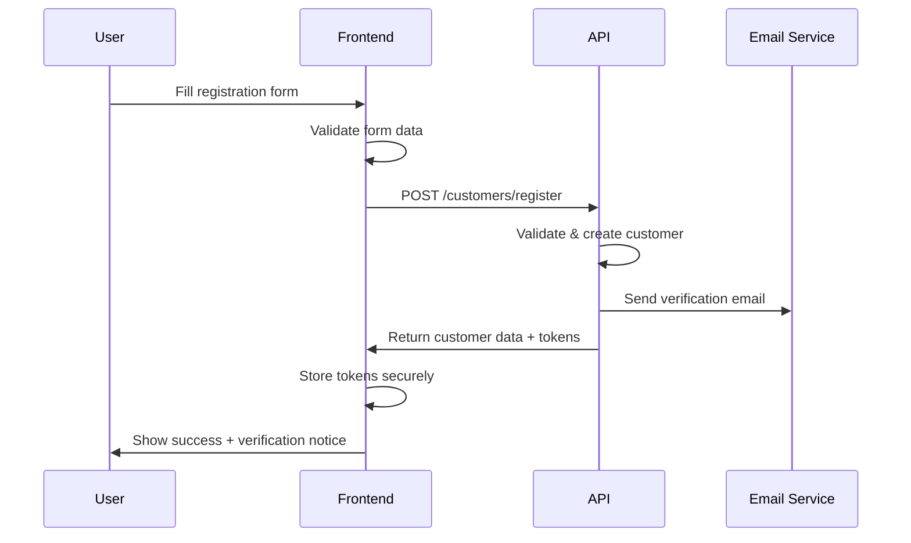
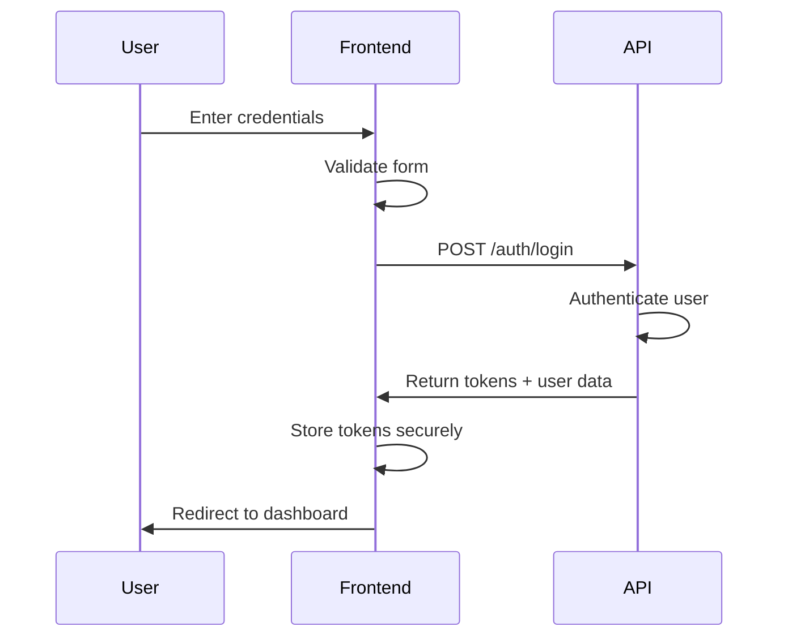
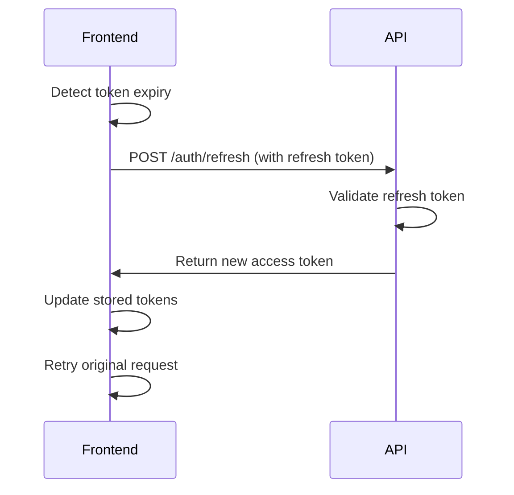

# Frontend Customer Authentication Implementation Guide

## Overview

This document provides comprehensive guidance for implementing storefront customer registration and login functionality on the frontend. The implementation is based on the SmartSeller Backend API specifications and follows modern authentication best practices.

## Table of Contents

1. [API Endpoints Overview](#api-endpoints-overview)
2. [Authentication Flow](#authentication-flow)
3. [Data Models & DTOs](#data-models--dtos)
4. [Implementation Examples](#implementation-examples)
5. [Security Considerations](#security-considerations)
6. [Error Handling](#error-handling)
7. [Testing Guidelines](#testing-guidelines)
8. [Best Practices](#best-practices)

## API Endpoints Overview

### Base URL Structure
```
Base URL: https://api.smartseller.com/api/v1
Storefront-specific: https://api.smartseller.com/api/storefront/{storefront_slug}
```

### Authentication Endpoints

#### 1. Customer Registration
```http
POST /api/v1/customers/register
Content-Type: application/json
```

#### 2. Customer Login
```http
POST /api/v1/auth/login
Content-Type: application/json
```

#### 3. Token Refresh
```http
POST /api/v1/auth/refresh
Content-Type: application/json
Authorization: Bearer {refresh_token}
```

#### 4. Logout
```http
POST /api/v1/auth/logout
Content-Type: application/json
Authorization: Bearer {access_token}
```

#### 5. Password Reset Flow
```http
POST /api/v1/auth/forgot-password    # Request reset
POST /api/v1/auth/reset-password     # Confirm reset
```

#### 6. Email Verification
```http
POST /api/v1/auth/verify-email       # Verify email with token
```

#### 7. Social Authentication
```http
GET  /api/v1/auth/google/login       # Get Google OAuth URL
GET  /api/v1/auth/google/callback    # Handle Google callback
```

## Authentication Flow

### 1. Registration Flow



### 2. Login Flow



### 3. Token Refresh Flow



## Data Models & DTOs

### Customer Registration Request
```typescript
interface CustomerRegistrationRequest {
  email: string;                    // Required, valid email format
  phone?: string;                   // Optional, valid phone format
  password: string;                 // Required, min 8 characters
  confirmPassword: string;          // Required, must match password
  firstName: string;                // Required, 2-50 characters
  lastName: string;                 // Required, 2-50 characters
  dateOfBirth?: string;            // Optional, ISO date format
  gender?: 'male' | 'female' | 'other' | 'prefer_not_to_say';
  acceptTerms: boolean;             // Required, must be true
  marketingConsent?: boolean;       // Optional, default false
}
```

### Customer Login Request
```typescript
interface CustomerAuthRequest {
  identifier: string;               // Email or phone number
  password: string;                 // User password
  rememberMe?: boolean;            // Optional, extends session
}
```

### Authentication Response
```typescript
interface CustomerAuthResponse {
  customer: {
    id: string;
    email: string;
    phone?: string;
    firstName: string;
    lastName: string;
    dateOfBirth?: string;
    gender?: string;
    isEmailVerified: boolean;
    isPhoneVerified: boolean;
    status: 'active' | 'inactive' | 'suspended';
    createdAt: string;
    updatedAt: string;
  };
  accessToken: string;              // JWT access token
  refreshToken: string;             // JWT refresh token
  tokenType: string;                // "Bearer"
  expiresIn: number;               // Token expiry in seconds
}
```

### Error Response
```typescript
interface ErrorResponse {
  error: {
    code: string;                   // Error code (e.g., "VALIDATION_FAILED")
    message: string;                // Human-readable error message
    fields?: FieldError[];          // Field-specific validation errors
  };
}

interface FieldError {
  field: string;                    // Field name
  message: string;                  // Error message
  rule: string;                     // Validation rule that failed
}
```

### Success Response
```typescript
interface SuccessResponse<T = any> {
  success: boolean;                 // Always true for success
  message: string;                  // Success message
  data?: T;                        // Response data
}
```

## Implementation Examples

### 1. Registration Implementation (React/TypeScript)

```typescript
import { useState } from 'react';
import { z } from 'zod';

// Validation schema
const registrationSchema = z.object({
  email: z.string().email('Invalid email format'),
  phone: z.string().optional(),
  password: z.string().min(8, 'Password must be at least 8 characters'),
  confirmPassword: z.string(),
  firstName: z.string().min(2, 'First name must be at least 2 characters'),
  lastName: z.string().min(2, 'Last name must be at least 2 characters'),
  dateOfBirth: z.string().optional(),
  gender: z.enum(['male', 'female', 'other', 'prefer_not_to_say']).optional(),
  acceptTerms: z.boolean().refine(val => val === true, 'You must accept the terms'),
  marketingConsent: z.boolean().optional(),
}).refine(data => data.password === data.confirmPassword, {
  message: "Passwords don't match",
  path: ["confirmPassword"],
});

type RegistrationForm = z.infer<typeof registrationSchema>;

export const useCustomerRegistration = () => {
  const [loading, setLoading] = useState(false);
  const [errors, setErrors] = useState<Record<string, string>>({});

  const register = async (data: RegistrationForm) => {
    setLoading(true);
    setErrors({});

    try {
      // Validate form data
      const validatedData = registrationSchema.parse(data);

      // Remove confirmPassword before sending to API
      const { confirmPassword, ...registrationData } = validatedData;

      const response = await fetch('/api/v1/customers/register', {
        method: 'POST',
        headers: {
          'Content-Type': 'application/json',
        },
        body: JSON.stringify(registrationData),
      });

      const result = await response.json();

      if (!response.ok) {
        if (result.error?.fields) {
          // Handle field-specific errors
          const fieldErrors: Record<string, string> = {};
          result.error.fields.forEach((field: FieldError) => {
            fieldErrors[field.field] = field.message;
          });
          setErrors(fieldErrors);
        } else {
          throw new Error(result.error?.message || 'Registration failed');
        }
        return { success: false };
      }

      // Store tokens securely
      const authData = result.data as CustomerAuthResponse;
      await storeTokens(authData.accessToken, authData.refreshToken);

      return { success: true, data: authData };
    } catch (error) {
      if (error instanceof z.ZodError) {
        // Handle validation errors
        const fieldErrors: Record<string, string> = {};
        error.errors.forEach(err => {
          if (err.path.length > 0) {
            fieldErrors[err.path[0] as string] = err.message;
          }
        });
        setErrors(fieldErrors);
      } else {
        setErrors({ general: (error as Error).message });
      }
      return { success: false };
    } finally {
      setLoading(false);
    }
  };

  return { register, loading, errors };
};
```

### 2. Login Implementation

```typescript
export const useCustomerLogin = () => {
  const [loading, setLoading] = useState(false);
  const [errors, setErrors] = useState<Record<string, string>>({});

  const login = async (identifier: string, password: string, rememberMe = false) => {
    setLoading(true);
    setErrors({});

    try {
      const response = await fetch('/api/v1/auth/login', {
        method: 'POST',
        headers: {
          'Content-Type': 'application/json',
        },
        body: JSON.stringify({
          identifier,
          password,
          rememberMe,
        }),
      });

      const result = await response.json();

      if (!response.ok) {
        if (response.status === 401) {
          setErrors({ credentials: 'Invalid email/phone or password' });
        } else if (result.error?.fields) {
          const fieldErrors: Record<string, string> = {};
          result.error.fields.forEach((field: FieldError) => {
            fieldErrors[field.field] = field.message;
          });
          setErrors(fieldErrors);
        } else {
          throw new Error(result.error?.message || 'Login failed');
        }
        return { success: false };
      }

      // Store tokens securely
      const authData = result.data as CustomerAuthResponse;
      await storeTokens(authData.accessToken, authData.refreshToken);

      return { success: true, data: authData };
    } catch (error) {
      setErrors({ general: (error as Error).message });
      return { success: false };
    } finally {
      setLoading(false);
    }
  };

  return { login, loading, errors };
};
```

### 3. Token Management

```typescript
// Token storage utilities
export const TokenStorage = {
  // Store tokens securely
  async storeTokens(accessToken: string, refreshToken: string): Promise<void> {
    // Use secure storage (e.g., httpOnly cookies, secure localStorage)
    if (typeof window !== 'undefined') {
      // For web applications
      localStorage.setItem('access_token', accessToken);
      localStorage.setItem('refresh_token', refreshToken);
    }
  },

  // Get access token
  getAccessToken(): string | null {
    if (typeof window !== 'undefined') {
      return localStorage.getItem('access_token');
    }
    return null;
  },

  // Get refresh token
  getRefreshToken(): string | null {
    if (typeof window !== 'undefined') {
      return localStorage.getItem('refresh_token');
    }
    return null;
  },

  // Clear tokens
  clearTokens(): void {
    if (typeof window !== 'undefined') {
      localStorage.removeItem('access_token');
      localStorage.removeItem('refresh_token');
    }
  },

  // Check if tokens exist
  hasTokens(): boolean {
    return !!(this.getAccessToken() && this.getRefreshToken());
  },
};

// HTTP client with automatic token refresh
export class AuthenticatedHttpClient {
  private baseURL: string;
  private isRefreshing = false;
  private refreshPromise: Promise<string> | null = null;

  constructor(baseURL: string) {
    this.baseURL = baseURL;
  }

  async request<T>(
    endpoint: string,
    options: RequestInit = {}
  ): Promise<T> {
    const url = `${this.baseURL}${endpoint}`;
    const accessToken = TokenStorage.getAccessToken();

    // Add authorization header if token exists
    const headers = {
      'Content-Type': 'application/json',
      ...options.headers,
      ...(accessToken && { Authorization: `Bearer ${accessToken}` }),
    };

    let response = await fetch(url, {
      ...options,
      headers,
    });

    // Handle token expiry
    if (response.status === 401 && accessToken) {
      const newToken = await this.refreshToken();
      if (newToken) {
        // Retry request with new token
        response = await fetch(url, {
          ...options,
          headers: {
            ...headers,
            Authorization: `Bearer ${newToken}`,
          },
        });
      }
    }

    if (!response.ok) {
      const error = await response.json();
      throw new Error(error.error?.message || 'Request failed');
    }

    return response.json();
  }

  private async refreshToken(): Promise<string | null> {
    if (this.isRefreshing && this.refreshPromise) {
      return this.refreshPromise;
    }

    this.isRefreshing = true;
    this.refreshPromise = this.performTokenRefresh();

    try {
      const newToken = await this.refreshPromise;
      return newToken;
    } finally {
      this.isRefreshing = false;
      this.refreshPromise = null;
    }
  }

  private async performTokenRefresh(): Promise<string | null> {
    const refreshToken = TokenStorage.getRefreshToken();
    if (!refreshToken) {
      TokenStorage.clearTokens();
      return null;
    }

    try {
      const response = await fetch(`${this.baseURL}/api/v1/auth/refresh`, {
        method: 'POST',
        headers: {
          'Content-Type': 'application/json',
          Authorization: `Bearer ${refreshToken}`,
        },
      });

      if (!response.ok) {
        TokenStorage.clearTokens();
        return null;
      }

      const result = await response.json();
      const newAccessToken = result.data.accessToken;
      
      // Update stored token
      await TokenStorage.storeTokens(newAccessToken, refreshToken);
      
      return newAccessToken;
    } catch (error) {
      TokenStorage.clearTokens();
      return null;
    }
  }
}
```

### 4. Social Authentication Implementation

```typescript
export const useSocialAuth = () => {
  const [loading, setLoading] = useState(false);

  const loginWithGoogle = async () => {
    setLoading(true);
    try {
      // Get Google OAuth URL
      const response = await fetch('/api/v1/auth/google/login');
      const result = await response.json();
      
      if (!response.ok) {
        throw new Error(result.error?.message || 'Failed to get auth URL');
      }

      // Redirect to Google OAuth
      window.location.href = result.data.authUrl;
    } catch (error) {
      console.error('Google login error:', error);
      setLoading(false);
    }
  };

  const handleOAuthCallback = async (code: string, state: string) => {
    try {
      const response = await fetch('/api/v1/auth/google/callback', {
        method: 'POST',
        headers: {
          'Content-Type': 'application/json',
        },
        body: JSON.stringify({ code, state }),
      });

      const result = await response.json();

      if (!response.ok) {
        throw new Error(result.error?.message || 'OAuth callback failed');
      }

      // Store tokens and redirect
      const authData = result.data as CustomerAuthResponse;
      await TokenStorage.storeTokens(authData.accessToken, authData.refreshToken);
      
      return { success: true, data: authData };
    } catch (error) {
      return { success: false, error: (error as Error).message };
    }
  };

  return { loginWithGoogle, handleOAuthCallback, loading };
};
```

## Security Considerations

### 1. Token Storage
- **Web Applications**: Use httpOnly cookies for production
- **Mobile Apps**: Use secure keychain/keystore
- **Development**: localStorage is acceptable for development only

### 2. HTTPS Only
- All authentication endpoints must use HTTPS
- Implement HSTS headers
- Use secure cookie flags

### 3. CSRF Protection
- Implement CSRF tokens for state-changing operations
- Validate state parameters in OAuth flows
- Use SameSite cookie attributes

### 4. Rate Limiting
- Implement client-side rate limiting
- Handle 429 responses gracefully
- Show appropriate user feedback

### 5. Input Validation
- Always validate on both client and server
- Sanitize user inputs
- Use strong password requirements

## Error Handling

### Common Error Codes

| Code | Description | Action |
|------|-------------|---------|
| `VALIDATION_FAILED` | Form validation errors | Show field-specific errors |
| `EMAIL_ALREADY_EXISTS` | Email already registered | Suggest login or password reset |
| `INVALID_CREDENTIALS` | Wrong email/password | Show generic error message |
| `ACCOUNT_SUSPENDED` | Account is suspended | Contact support message |
| `EMAIL_NOT_VERIFIED` | Email verification required | Show verification prompt |
| `RATE_LIMIT_EXCEEDED` | Too many requests | Show retry timer |
| `TOKEN_EXPIRED` | Access token expired | Attempt token refresh |
| `INVALID_TOKEN` | Invalid or malformed token | Clear tokens and redirect to login |

### Error Handling Best Practices

```typescript
export const handleAuthError = (error: ErrorResponse, context: string) => {
  switch (error.error.code) {
    case 'VALIDATION_FAILED':
      // Handle field validation errors
      return error.error.fields || [];
    
    case 'EMAIL_ALREADY_EXISTS':
      return [{
        field: 'email',
        message: 'This email is already registered. Try logging in instead.',
        rule: 'unique'
      }];
    
    case 'INVALID_CREDENTIALS':
      return [{
        field: 'credentials',
        message: 'Invalid email or password. Please try again.',
        rule: 'authentication'
      }];
    
    case 'ACCOUNT_SUSPENDED':
      // Redirect to support page
      window.location.href = '/support';
      return [];
    
    case 'EMAIL_NOT_VERIFIED':
      // Show email verification prompt
      return [{
        field: 'email',
        message: 'Please verify your email address to continue.',
        rule: 'verification'
      }];
    
    case 'RATE_LIMIT_EXCEEDED':
      return [{
        field: 'general',
        message: 'Too many attempts. Please try again later.',
        rule: 'rate_limit'
      }];
    
    default:
      return [{
        field: 'general',
        message: error.error.message || 'An unexpected error occurred.',
        rule: 'unknown'
      }];
  }
};
```

## Testing Guidelines

### 1. Unit Tests

```typescript
// Example test for registration hook
describe('useCustomerRegistration', () => {
  it('should validate form data before submission', async () => {
    const { result } = renderHook(() => useCustomerRegistration());
    
    const invalidData = {
      email: 'invalid-email',
      password: '123', // Too short
      confirmPassword: '456', // Doesn't match
      firstName: '',
      lastName: '',
      acceptTerms: false,
    };

    await act(async () => {
      const response = await result.current.register(invalidData);
      expect(response.success).toBe(false);
    });

    expect(result.current.errors).toHaveProperty('email');
    expect(result.current.errors).toHaveProperty('password');
    expect(result.current.errors).toHaveProperty('confirmPassword');
  });

  it('should handle successful registration', async () => {
    // Mock successful API response
    global.fetch = jest.fn().mockResolvedValue({
      ok: true,
      json: () => Promise.resolve({
        success: true,
        data: mockAuthResponse,
      }),
    });

    const { result } = renderHook(() => useCustomerRegistration());
    
    const validData = {
      email: 'test@example.com',
      password: 'password123',
      confirmPassword: 'password123',
      firstName: 'John',
      lastName: 'Doe',
      acceptTerms: true,
    };

    await act(async () => {
      const response = await result.current.register(validData);
      expect(response.success).toBe(true);
    });
  });
});
```

### 2. Integration Tests

```typescript
// Example integration test
describe('Customer Authentication Flow', () => {
  it('should complete full registration and login flow', async () => {
    // Test registration
    const registrationData = {
      email: 'newuser@example.com',
      password: 'password123',
      confirmPassword: 'password123',
      firstName: 'New',
      lastName: 'User',
      acceptTerms: true,
    };

    const registrationResponse = await apiClient.post('/customers/register', registrationData);
    expect(registrationResponse.status).toBe(201);

    // Test login with registered credentials
    const loginData = {
      identifier: 'newuser@example.com',
      password: 'password123',
    };

    const loginResponse = await apiClient.post('/auth/login', loginData);
    expect(loginResponse.status).toBe(200);
    expect(loginResponse.data.data).toHaveProperty('accessToken');
  });
});
```

## Best Practices

### 1. User Experience
- Provide clear, actionable error messages
- Show loading states during API calls
- Implement proper form validation feedback
- Use progressive enhancement for JavaScript-disabled users

### 2. Performance
- Implement proper caching strategies
- Use debounced validation for real-time feedback
- Optimize bundle size with code splitting
- Implement proper loading states

### 3. Accessibility
- Ensure proper ARIA labels and roles
- Implement keyboard navigation
- Provide screen reader friendly error messages
- Use semantic HTML elements

### 4. Security
- Never log sensitive information
- Implement proper session timeout
- Use secure communication channels
- Validate all inputs on both client and server

### 5. Monitoring
- Implement error tracking (e.g., Sentry)
- Monitor authentication success/failure rates
- Track user journey analytics
- Set up alerts for unusual patterns

## Conclusion

This implementation guide provides a comprehensive foundation for building secure and user-friendly customer authentication features. Remember to:

1. Always validate inputs on both client and server
2. Handle errors gracefully with clear user feedback
3. Implement proper security measures
4. Test thoroughly across different scenarios
5. Monitor and maintain the authentication system

For additional support or questions, refer to the API documentation or contact the backend development team.